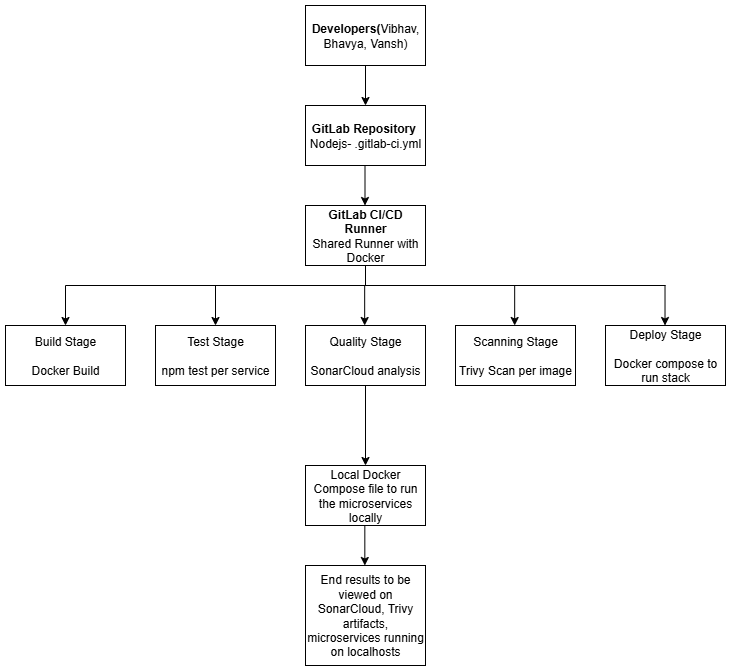

# 🚀 GitLab CI/CD DevOps Project – Microservices Automation

A DevOps automation project that implements CI/CD pipelines using **GitLab**, **Docker**, **SonarCloud**, and **Trivy** to manage and deploy a Node.js-based microservices application. The pipeline ensures automated builds, test coverage reporting, security scanning, and containerized deployment via Docker Compose.
GitLab CI/CD for Microservices is a comprehensive DevOps project aimed at automating the development, testing, security analysis, and deployment of a Node.js-based microservices system. Built entirely on the GitLab platform, the pipeline uses a declarative .gitlab-ci.yml configuration to orchestrate builds, run unit tests with coverage, scan for vulnerabilities, and deploy services using Docker. This integration enables seamless delivery of code changes across multiple services, eliminating the need for manual workflows or third-party tools. 

---

## 🧑‍💻 Team Members

- **Vibhav Khaneja** (Lead)
- Vansh Gupta
- Bhavya Jain

---

## 📁 Microservices Repository

Services included:

- `auth-service`
- `product-service`
- `cart-service`

---

## 🎯 Objective

To build a secure and automated CI/CD pipeline for a multi-service Node.js application using GitLab CI/CD, while integrating:

- Code quality checks (SonarCloud)
- Security scanning (Trivy)
- Test coverage tracking (Jest + lcov)
- Docker-based microservice architecture
- Docker Compose-based deployment

---

## ⚙️ Tools & Technologies Used

| Category      | Tools/Tech                                  |
|---------------|----------------------------------------------|
| CI/CD         | GitLab CI/CD, `.gitlab-ci.yml`               |
| Containerization | Docker, Docker Compose                    |
| Testing       | Jest, Supertest                              |
| Code Quality  | SonarCloud                                   |
| Security      | Trivy                                        |
| SCM           | Git, GitHub, GitLab                          |
| Scripting     | Shell commands in CI jobs                    |

---

## 🧱 Pipeline Structure

The `.gitlab-ci.yml` defines 5 key stages:

1. **Build** – Docker builds for each service
2. **Test** – Run unit tests using Jest with coverage reporting
3. **Quality** – SonarCloud analysis for code quality & coverage
4. **Scan** – Trivy scan for HIGH/CRITICAL vulnerabilities in images
5. **Deploy** – Local deployment using Docker Compose (ports: 3001–3003)



---

## 📊 SonarCloud Summary

Test coverage and code quality is tracked through SonarCloud. For this project:

- Overall test coverage reported: **22.32%**
- Quality gate status enforced in CI pipeline
- `lcov.info` reports from each service passed as artifacts between stages

---

## 🔐 Security Scanning

Each Docker image is scanned with **Trivy**, and critical vulnerabilities are logged:

- Results saved as JSON artifacts in GitLab CI
- Example: `cart-service` scan shows 9 critical, 256 high vulnerabilities

---

## 🧪 Local Deployment

Run all services locally with Docker Compose:

```bash
docker-compose up -d --build


##  Feedback of Team Members: 
Bhavya Jain: Didnt respond to the main group/ channel which was created due to which there was no response from his side towards the project, contated me once on personal channel to learn how to operate on gitlab but didnt reply to any work related messages on the official channel.
Productivity: Completed the documentation part of the project on the last day.

Vansh Gupta: Didnt respond to the main group/ channel which was created due to which there was no response from his side towards the project, didnt even contaced me on personal channel so there was 0 collaboration during the implementation process/ phase of the project.
Productivity: Completed the ppt of the project on the last day
